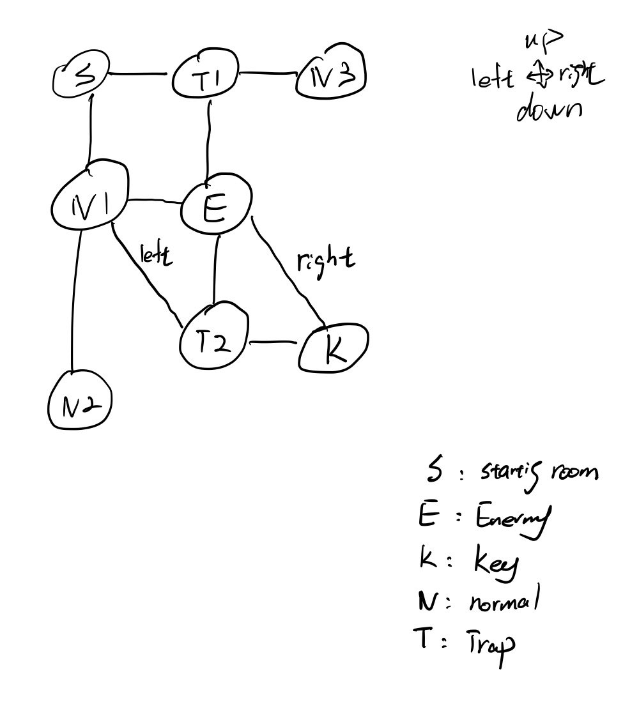

# DungeonGame

## Introduction
For our project, we aimed to create a text-based "maze" game. The user will use command inputs to navigate through a maze and look for a room that contains a key, then return to the starting room to "escape" beat the game.
## Usage
First, the executable should be using "make" in the terminal. To begin the game, the executable can be ran using "./bin/exec".

Once in game, the game will let you know what commands you can use. The commands must be in the format "command target", where command is the action that should be taken and target is the target of the action separated by a space. 

Not every corridor connecting the rooms are straightforward paths; some paths may wind such that the player may go "right" to enter the room, but must go "up" to leave the room. 

We leave it up to the player to keep track of their progression and map out the rooms; however, the solution is shown here. Note that room types in the current version of the game may differ from those in the picture.

For testing purposes, the right path for progression is (right, down, right) to the key room, and (up, up, left) hto the begining.

## Implementation
We used 4 different classes to manage the game; the "item" class manages the items that can be picked up and/or used, the "room" class manages the properties of the different rooms that can be visited, the "character" class manages the properties of player character, and the "game" class manages the properties of the overall game as well as parsing user input.

